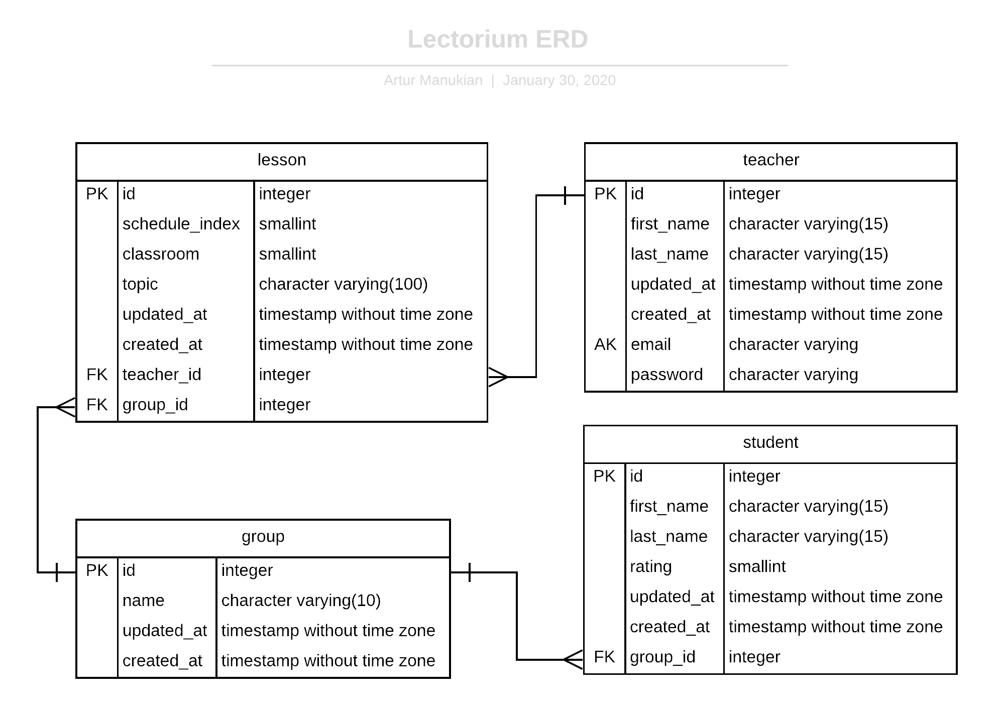

# lectorium

#### CLI commands
1. `npm i` - install dependencies
2. `npm run start` - production mode
3. `npm run dev` - development mode
4. `npm run dev:debug` - debug mode
   - host: `localhost`
   - port: `9229`
5. `migration:create [name]` - create migration with name
6. `migration:generate [name]` - autogenerate migration with name
7. `migration:run` - run migrations
8. `migration:revert` - revert last migration
9. `migration:show` - show all migrations
10. `schema:sync` - synchronize migrations
11. `schema:drop` - drop database schema

#### Entity Relationship Diagram

